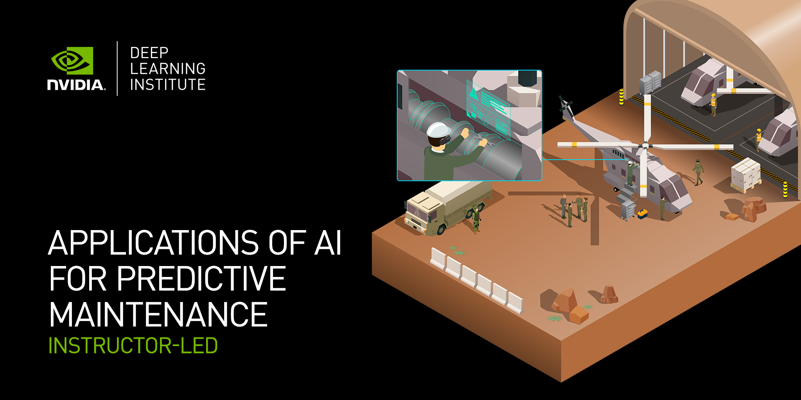

# Predictive Maintenance with AI Workshop

## Table of Contents
1. [Description](#description)
2. [Information](#information)
3. [File Descriptions](#files)
4. [Certificate](#certificate)
5. [Quizzes](#quizzes)

## Description

According to the International Society of Automation, $647 billion is lost globally each year due to downtime from machine failure. Organizations across manufacturing, aerospace, energy, and other industrial sectors are leveraging artificial intelligence and machine learning for predictive maintenance. This workshop focuses on identifying anomalies in time-series data, estimating remaining useful life, and mapping anomalies to failure conditions. Participants learn to use AI to predict equipment conditions and optimize maintenance schedules, thus minimizing costly downtime.

## Information

The goals of this workshop are:
- Use AI-based predictive maintenance to prevent failures and unplanned downtimes.
- Identify challenges in anomaly detection leading to costly breakdowns.
- Predict outcomes using XGBoost-based machine learning models for time-series data.
- Implement LSTM models for equipment failure prediction.
- Utilize autoencoders for anomaly detection with limited failure-example data.

For detailed information and links, visit the [course website](https://www.nvidia.com/en-us/training/instructor-led-workshops/predictive-maintenance/).

## File Descriptions

### 1 - Training XGBoost Models with RAPIDS for Time Series:
- [Lab1-XGBoost-For-Timeseries](https://github.com/SAIRAMROCKHY/Applications-of-AI-for-Predictive-Maintenance-NVIDIA/blob/main/Lab1-XGBoost-For-Timeseries.ipynb) - Notebook
- [Lab1-Presentation_202208](https://github.com/SAIRAMROCKHY/Applications-of-AI-for-Predictive-Maintenance-NVIDIA/blob/main/Lab1-Presentation_202208.pptx) - Slides

Learn to predict part failures using XGBoost classification on GPUs with cuDF:
- Prepare real data for efficient GPU ingestion with RAPIDS cuDF.
- Train classification models using GPU-accelerated XGBoost and compare performance.

### 2 - Training LSTM Models Using Keras and TensorFlow for Time Series:
- [Lab2-LSTM-For-Timeseries](https://github.com/SAIRAMROCKHY/Applications-of-AI-for-Predictive-Maintenance-NVIDIA/blob/main/Lab2-LSTM-For-Timeseries.ipynb) - Notebook
- [Lab2-Presentation_202208](https://github.com/SAIRAMROCKHY/Applications-of-AI-for-Predictive-Maintenance-NVIDIA/blob/main/Lab2-Presentation_202208.pptx) - Slides

Learn to predict part failures using deep learning LSTM models with time-series data:
- Prepare sequenced data for training LSTM models.
- Build, train, and evaluate LSTM models using Keras and TensorFlow.

### 3 - Training Autoencoders for Anomaly Detection:
- [Lab3-AE-For-Anomaly-Detection](https://github.com/SAIRAMROCKHY/Applications-of-AI-for-Predictive-Maintenance-NVIDIA/blob/main/Lab3-AE-For-Anomaly-Detection.ipynb) - Notebook
- [Lab3-Presentation_202208](https://github.com/SAIRAMROCKHY/Applications-of-AI-for-Predictive-Maintenance-NVIDIA/blob/main/Lab3-Presentation_202208.pptx) - Slides
- [assignment](https://github.com/SAIRAMROCKHY/Applications-of-AI-for-Predictive-Maintenance-NVIDIA/blob/main/assignment.py) - Assessment

Learn to predict part failures using anomaly detection with autoencoders:
- Build and train LSTM and 1D convolutional autoencoders.
- Experiment with hyperparameters and compare model results.

## Certificate

Upon successful completion of the workshop and assessment, participants will receive an NVIDIA DLI certificate.

## Quizzes

### Quiz 1: 
- [Quiz 1](https://github.com/SAIRAMROCKHY/Applications-of-AI-for-Predictive-Maintenance-NVIDIA/blob/main/Quiz-1.txt) - Questions and Answers

### Quiz 2: 
- [Quiz 2](https://github.com/SAIRAMROCKHY/Applications-of-AI-for-Predictive-Maintenance-NVIDIA/blob/main/Quiz-2.txt) - Questions and Answers

### Quiz 3: 
- [Quiz 3](https://github.com/SAIRAMROCKHY/Applications-of-AI-for-Predictive-Maintenance-NVIDIA/blob/main/Quiz-3.txt) - Questions and Answers

Feel free to explore the workshop materials and quizzes. For any questions or feedback, please reach out!
